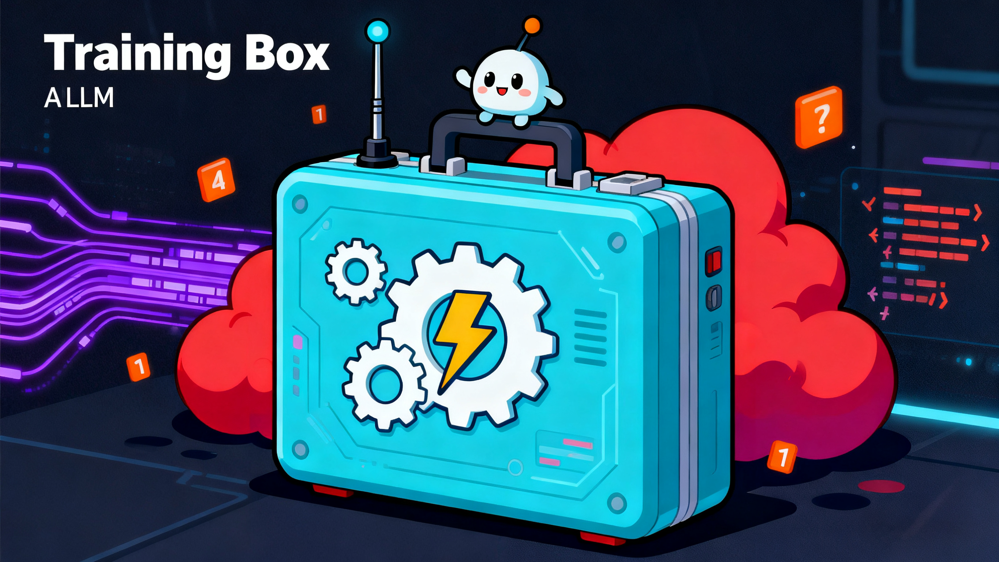

# Training Box

### 训练大语言模型的工具箱（预训练、微调、强化学习）
Toolkit for Training Large Language Models (`Pretraining`, `Fine-tuning`, `RL`)

## 安装依赖项
```python
cd Training-Box
conda create -n train_box python=3.10 -y && conda activate train_box
pip install -r requirements.txt -i https://pypi.tuna.tsinghua.edu.cn/simple
```

## 准备模型
```python
export HF_ENDPOINT=https://hf-mirror.com
huggingface-cli download --resume-download <model_id> --local-dir ./models/<model_name>
# 或 modelscope download --model <model_id> --local_dir ./models/<model_name>
```

## 训练LLM
### 预训练
[**预训练语料**](./data/pretrain)
[**配置文件**](./yaml/continue_pretrain.yaml)
#### run
```python
CUDA_VISIBLE_DEVICES=0 python continue_pretrain.py -f ./yaml/continue_pretrain.yaml
```

### 微调
[**文本数据集**](./data/sft/llm)
[**配置文件**](./yaml/sft.yaml)
#### run
```python
CUDA_VISIBLE_DEVICES=0 python sft.py -f ./yaml/sft.yaml
```
[**多模态数据集**](./data/sft/vlm)
[**配置文件**](./yaml/sft_v.yaml)
#### run
```python
CUDA_VISIBLE_DEVICES=0 python sft_v.py -f ./yaml/sft_v.yaml
```

### 强化学习
[**DPO数据集**](./data/rl/dpo)
[**配置文件**](./yaml/dpo.yaml)
#### run
```python
CUDA_VISIBLE_DEVICES=0 python dpo.py -f ./yaml/dpo.yaml
```
[**PPO数据集**](./data/rl/ppo)
[**配置文件**](./yaml/ppo.yaml)
#### run
```python
CUDA_VISIBLE_DEVICES=0 python ppo.py -f ./yaml/ppo.yaml
```
[**GRPO数据集**](./data/rl/grpo)
[**配置文件**](./yaml/grpo.yaml)
#### run
```python
CUDA_VISIBLE_DEVICES=0 python grpo.py -f ./yaml/grpo.yaml
```
